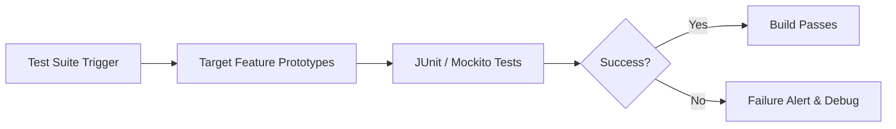

<!-- ========== NEW: ANIMATED WAVE HEADER ========== -->
<!-- ========== NEW: TYPING ANIMATION INTRO ========== -->
<p align="center">
  
</p>

<!-- ========== NEW: HIGH QUALITY PROJECT BANNER ========== -->
<p align="center">
  
</p>


<!-- ========== NEW: AUTHOR & ARCHITECT SECTION ========== -->
## 👨‍💻 Author & Architect

<table>
<tr>
<td align="center" width="160">
  <a href="https://github.com/Sadique721">
    <br>
    <b>Md Sadique Amin</b><br>
    <sub>Backend Java Developer</sub>
  </a>
</td>
<td>

**Md Sadique Amin** — Backend Java Developer.

- 🔗 GitHub: [@Sadique721](https://github.com/Sadique721)
- 📧 Email: mdsadiqueamin721786@gmail.com
- 🏗️ Built: Enterprise BSS-OSS Telecom Suite, Backend Java Developer, IR Interconnect & Roaming

</td>
</tr>
</table>

<!-- ========== NEW: SYSTEM DIAGRAM SECTION ========== -->
## 📊 System Architecture & Workflow



---

<!-- ================================================================= -->
<!-- ========== 🌟 ANIMATED HEADER BANNER & PROFILE IDENTITY ========== -->
<!-- ================================================================= -->

<p align="center">
  
</p>

<p align="center">
  
</p>

<p align="center">
  <a href="https://github.com/Sadique721"></a>
  <a href="https://github.com/Sadique721/Test-Project"></a>
  <a href="https://github.com/Sadique721/Test-Project/network/members"></a>
  <a href="https://github.com/Sadique721?tab=followers"></a>
</p>

<p align="center">
  <a href="https://github.com/Sadique721"></a>
  <a href="https://github.com/Sadique721?tab=repositories"></a>
  <a href="https://github.com/Sadique721/Test-Project/issues"></a>
  <a href="#-17-contributing-governance--licensing"></a>
  <a href="#-1-executive-architectural-overview"></a>
</p>

```text
┌──(sadique721⚡developer-machine)-[~/BSS-OSS]
└─$ neofetch -------------------------------------------------------------------┐
│                                                                               │
│   💻 Platform    : BSS-OSS Enterprise Telecom & AAA Charging Suite            │
│   👨‍💻 Architect   : ☕ Md Sadique Amin (Java Developer @ Keyanna Technology)    │
│   🏢 Deployment  : 🌐 Tier-1 Telecom Operators, FTTH ISPs & 4G/5G Networks   │
│   ⚡ Core Engine : ☕ Java 17/11 • 🌱 Spring Boot 3 • 🧱 14 Microservices      │
│   📡 AAA Protocols: 📶 3GPP Diameter (Gy/Ro/Gx) • 📡 FreeRADIUS (CoA/PoD)     │
│   🔄 Event Stream: 🚀 Apache Kafka • 🐬 MySQL 8.0 • 📦 Docker Container Mesh   │
│   📱 Frontends   : 🅰️ Angular 11/12 Admin & CWSC • 📱 Flutter Mobile Apps      │
│   🚀 Uptime SLA  : 🟢 99.999% High-Availability (Five Nines) Carrier-Grade   │
│   📫 Author      : 📧 mdsadiqueamin721786@gmail.com | 🌐 GitHub: @Sadique721  │
│                                                                               │
└-------------------------------------------------------------------------------┘
```

<p align="center">
  
  
  
  
</p>

<p align="center">
  <a href="https://myportfoliositesadique.netlify.app/"></a>
  <a href="mailto:mdsadiqueamin721786@gmail.com"></a>
  <a href="https://www.linkedin.com/in/md-sadique-amin-b6a948198/"></a>
  <a href="https://github.com/Sadique721"></a>
  <a href="http://www.youtube.com/@mdsadiqueamin721"></a>
</p>

<div align="center">

[](https://www.oracle.com/java/)
[](https://spring.io/projects/spring-boot)
[](https://spring.io/projects/spring-cloud)
[](https://kafka.apache.org/)
[](https://www.3gpp.org/)
[](https://freeradius.org/)
[](https://angular.io/)
[](https://flutter.dev/)
[](https://www.docker.com/)
[](https://www.mysql.com/)
[-brightgreen?style=for-the-badge)](https://en.wikipedia.org/wiki/High_availability)

<br/>

**BSS-OSS (BillOS / Savbill Suite)** is an ultra-high-performance, mission-critical, enterprise-grade telecommunications and Internet Service Provider (ISP) software platform. Engineered to manage the complete lifecycle of millions of subscribers across **FTTH (Fiber to the Home)**, **High-Speed Broadband**, **4G/5G Cellular Mobility**, **Public Wi-Fi Hotspots**, and **Enterprise Leased Lines**, it delivers sub-millisecond real-time online charging, carrier-grade AAA session management, automated provisioning, dynamic billing, CRM, and omnichannel digital interfaces.

</div>

---

## 📑 Table of Contents

- [1. Executive Architectural Overview](#1-executive-architectural-overview)
- [2. End-to-End Telecom Physical & Digital Flow](#2-end-to-end-telecom-physical--digital-flow)
- [3. Complete System Architecture & Topology](#3-complete-system-architecture--topology)
- [4. Backend Microservices Directory (14 Core Services)](#4-backend-microservices-directory-14-core-services)
- [5. Diameter Protocol AAA & Charging Engine](#5-diameter-protocol-aaa--charging-engine)
- [6. FreeRADIUS AAA Session & Policy Enforcement Engine](#6-freeradius-aaa-session--policy-enforcement-engine)
- [7. Frontend & Mobile Ecosystem (4 Applications)](#7-frontend--mobile-ecosystem-4-applications)
- [8. Event-Driven Architecture & Apache Kafka Streaming](#8-event-driven-architecture--apache-kafka-streaming)
- [9. Database Architecture, Consistency & Persistence Layer](#9-database-architecture-consistency--persistence-layer)
- [10. Security, Multi-Tenancy & Regulatory Compliance](#10-security-multi-tenancy--regulatory-compliance)
- [11. Performance Engineering & High-Availability Optimization](#11-performance-engineering--high-availability-optimization)
- [12. Port Mapping & Network Infrastructure Matrix](#12-port-mapping--network-infrastructure-matrix)
- [13. Installation, Build & Local Deployment Guide](#13-installation-build--local-deployment-guide)
- [14. API Reference & Representative JSON Payloads](#14-api-reference--representative-json-payloads)
- [15. Enterprise Logging, Observability & Monitoring](#15-enterprise-logging-observability--monitoring)
- [16. Troubleshooting & Operational Runbook](#16-troubleshooting--operational-runbook)
- [17. Contributing, Governance & Licensing](#17-contributing-governance--licensing)

---

## 🏛️ 1. Executive Architectural Overview

The **BSS-OSS Platform** bridges the gap between physical telecommunications network hardware (OLT, BNG, BRAS, UPF, PGW) and high-level enterprise business operations (Billing, Invoicing, CRM, Partner Commissioning, Inventory, Customer Self-Care).

```
                                  +===================================+
                                  |     ENTERPRISE CLIENT LAYER       |
                                  | Angular Admin | Flutter Apps | Web|
                                  +=================+=================+
                                                    |
                                                    v [HTTPS / WSS / REST]
                                  +===================================+
                                  |      EDGE API GATEWAY (Zuul)      |
                                  | Auth | Rate-Limit | SSL | Routing |
                                  +=================+=================+
                                                    |
         +------------------------------------------+------------------------------------------+
         |                                          |                                          |
         v                                          v                                          v
+-----------------+                      +--------------------+                      +-------------------+
| SERVICE REGISTRY|                      | CORE BUSINESS APIS |                      |  AAA CHARGING BUS |
| Netflix Eureka  |<-------------------->| 12x Microservices  |<-------------------->| Diameter (Gy/Ro)  |
| Health Heartbeat|                      | Domain Logic & DB  |                      | RADIUS (Auth/Acc) |
+-----------------+                      +---------+----------+                      +---------+---------+
                                                   |                                           |
                                                   v                                           v
                                  +===================================+
                                  |   EVENT STREAMING & PERSISTENCE   |
                                  | Apache Kafka | MySQL 8 | EhCache  |
                                  +===================================+
```

### 🎯 Key Capabilities
1. **Real-Time Online Charging (OCS / CPM)**: Sub-5ms balance reservation, continuous rating, quota deduction, and credit-control for concurrent multi-service sessions (Data, Voice, SMS, VAS).
2. **Carrier-Grade AAA (Diameter & RADIUS)**: Full support for 3GPP TS 32.299 Diameter Gy/Ro/Gx interfaces alongside RFC 2865/2866/3576 FreeRADIUS Authentication, Accounting, CoA (Change of Authorization), and PoD (Packet of Disconnect).
3. **Automated FTTH & Network Provisioning**: Zero-touch provisioning for Optical Line Terminals (OLT), Optical Network Terminals (ONT/ONU), IP Pools (IPv4/IPv6 IPAM), and TR-069 ACS auto-configuration.
4. **Omnichannel Digital Self-Care**: Production-ready Angular Web Portals and Flutter Android/iOS applications for subscribers, retail customers, and field installation technicians.
5. **High Availability & Fault Tolerance**: Microservices isolated with Netflix Eureka discovery, Ribbon load balancing, Feign resilience, Kafka event queues, and HikariCP connection pooling.

---

## 🌊 2. End-to-End Telecom Physical & Digital Flow

Understanding how packet traffic flows from global internet backbones, submarine optical fibers, and core telecom routing hardware into the BSS-OSS platform:

```
[ Tier-1 Global Internet Data Centers / Content Backbones ]
                            |
                            v (Subsea Optical Fiber - DWDM High-Density Multi-Terabit Lasers)
[ Cable Landing Station (CLS) / Submarine Line Terminal Equipment (SLTE) ]
                            |
                            v (Terrestrial Dark Fiber Ring Backhaul - IP/MPLS Core Network)
[ Edge Broadband Network Gateway (BNG) / BRAS / 5G Core UPF ]
                            |
       +--------------------+--------------------+
       |                                         |
       v (FTTH Fixed-Line Path)                  v (Cellular / Wireless Path)
[ Optical Line Terminal (OLT) ]          [ 4G eNodeB / 5G gNodeB Tower ]
       | (Passive Optical Splitter 1:32 / 1:64)  | (GTP-U Encapsulated Tunnel)
[ Optical Network Unit (ONU) / ONT ]     [ 5G User Equipment / SIM Card ]
       |                                         |
       +--------------------+--------------------+
                            |
                            v [AAA & Charging Signals: RADIUS / Diameter Gy/Ro Packets]
       +-------------------------------------------------------------------+
       |                  BSS-OSS CORE TELECOM SUITE                       |
       |  common.gateway-dira  <-->  cpm.service  <-->  radius.service      |
       |  diameter-protocol    <-->  revenue.service <-->  salescrm.service|
       +-------------------------------------------------------------------+
```

---

## 🏗️ 3. Complete System Architecture & Topology

```mermaid
flowchart TB
    subgraph ClientLayer ["Client & Frontend Ecosystem"]
        AdminUI["Admin UI Portal\n(Angular 11/12)"]
        CWSC["Customer Web Self Care\n(Angular 11/12)"]
        CustApp["Customer Mobile App\n(Flutter iOS/Android)"]
        FieldApp["Field Tech Mobile App\n(Flutter iOS/Android)"]
    end

    subgraph NetworkEdge ["Network & Hardware Layer"]
        BNG["BNG / BRAS Router\n(MikroTik, Cisco, Juniper)"]
        OLT["FTTH OLT\n(Huawei, ZTE, Nokia)"]
        UPF["5G Core UPF / PGW"]
    end

    subgraph GatewayMesh ["Edge Gateway & Protocol Adapters"]
        Gateway["common.gateway-dira\n(Spring Cloud Zuul / Port 30080)"]
        RadiusSvc["radius.service\n(FreeRADIUS / Port 30087)"]
        DiameterEngine["Diameter Engine\n(Gy / Ro / Gx / Port 3868)"]
    end

    subgraph ServiceRegistry ["Service Discovery & Registry"]
        Eureka["service.registry-dira\n(Netflix Eureka / Port 8761)"]
    end

    subgraph CoreServices ["Core Business Microservices"]
        CPM["cpm.service\n(Online Charging & Policy\nPort 30085)"]
        Revenue["revenue.service\n(Billing & Invoicing\nPort 30088)"]
        SalesCRM["salescrm.service\n(Subscriber Lifecycle\nPort 30089)"]
        Inventory["inventory.service\n(IPAM & Stock\nPort 30083)"]
        TaskMgmt["task.management-dira\n(Field Operations\nPort 30090)"]
        Ticket["ticket.service\n(Helpdesk & Faults\nPort 30091)"]
        Partner["partner.service\n(LCO & Commission\nPort 30086)"]
        Integration["integration.service\n(Payment & SMS APIs\nPort 30082)"]
        Notification["nofitication.service\n(Event Alerts\nPort 30084)"]
        Captive["captiveportal.service\n(Wi-Fi Hotspot\nPort 30081)"]
        Migration["dira.migrationutility\n(ETL & Batch Import\nPort 30092)"]
    end

    subgraph EventStream ["Event Streaming & Messaging"]
        Kafka["Apache Kafka Cluster\n(Broker Port 29092 / 30084)"]
        Zookeeper["Apache ZooKeeper\n(Port 2181 / 12181)"]
    end

    subgraph DataStore ["Database & Persistence Tier"]
        DB_Gateway[(commongateway DB)]
        DB_CPM[(savbillcpm DB)]
        DB_Revenue[(savbillrevenue DB)]
        DB_CRM[(savbillcrm DB)]
        DB_Radius[(radius DB)]
        DB_Other[(Domain Specific DBs)]
    end

    AdminUI & CWSC & CustApp & FieldApp -->|HTTPS / REST| Gateway
    BNG & OLT -->|RADIUS Auth/Acct| RadiusSvc
    UPF & BNG -->|Diameter CCR/CCA| DiameterEngine

    Gateway <-->|Service Lookup| Eureka
    CoreServices <-->|Heartbeat Register| Eureka

    Gateway -->|Feign / HTTP| CPM & Revenue & SalesCRM & Inventory & TaskMgmt & Ticket & Partner & Integration & Captive
    DiameterEngine <-->|Inter-Process / REST| CPM
    RadiusSvc <-->|Quota Validation| CPM

    CPM & Revenue & SalesCRM & RadiusSvc -->|Publish Events| Kafka
    Kafka -->|Consume Events| Notification & Revenue & TaskMgmt
    Kafka <--> Zookeeper

    Gateway --> DB_Gateway
    CPM --> DB_CPM
    Revenue --> DB_Revenue
    SalesCRM --> DB_CRM
    RadiusSvc --> DB_Radius
    Inventory & Ticket & Partner & TaskMgmt --> DB_Other
```



---

## 📦 4. Backend Microservices Directory (14 Core Services)

The backend is decomposed into 14 highly specialized microservices, each operating with clear bounded contexts and database-per-service isolation:

| # | Service Directory | Service Name | Default Port | Primary Functionality | Core Technologies |
|---|-------------------|--------------|--------------|-----------------------|-------------------|
| 1 | `backend/common.gateway-dira` | `common.gateway-dira` | `30080` | Edge API Gateway, JWT Auth Verification, Dynamic URL Routing, Rate Limiting | Spring Boot, Netflix Zuul, Spring Cloud Gateway |
| 2 | `backend/service.registry-dira` | `service.registry-dira` | `8761` | Microservice Registry, Peer Replication, Instance Health Heartbeats | Spring Cloud Netflix Eureka Server |
| 3 | `backend/cpm.service` | `cpm.service` | `30085` | Central Policy Management, Online Charging System (OCS), Real-time Balance Deduction | Spring Boot, JPA, Hibernate, Kafka Producer, EhCache |
| 4 | `backend/radius.service` | `radius.service` | `30087` | FreeRADIUS AAA Engine, NAS Integration, CoA / Disconnect-Message (PoD) | Spring Boot, FreeRADIUS, JRadius, MySQL |
| 5 | `backend/revenue.service` | `revenue.service` | `30088` | Automated Invoicing, GST/Tax Breakdown, Wallets, Recurring Billing Cycles, Dunning | Spring Boot, JPA, Liquibase, PDF Generation, Kafka |
| 6 | `backend/salescrm.service` | `salescrm.service` | `30089` | Customer Onboarding (CAF/KYC), Plan Catalog, Lead Funnel, Service Areas | Spring Boot, REST APIs, Geo-Spatial Mapping |
| 7 | `backend/inventory.service` | `inventory.service` | `30083` | IPAM (IPv4/IPv6 Pools), ONT/ONU Hardware Stock, SIM Inventory, Warehouse Moves | Spring Boot, JPA, Barcode/QR Scanning APIs |
| 8 | `backend/task.management-dira`| `task.management-dira`| `30090` | Field Engineer Workflows, Installation Scheduling, SLA Breach Matrix | Spring Boot, State Machine Engine, Push Notifications |
| 9 | `backend/ticket.service` | `ticket.service` | `30091` | Customer Support Helpdesk, Fiber Cut Outage Automation, Root Cause Analysis | Spring Boot, Ticket Queue Router, Escalation Engine |
| 10| `backend/integration.service` | `integration.service` | `30082` | Payment Gateways (Razorpay/PayTM/Stripe), WhatsApp APIs, SMS Gateways, TR-069 | Spring Boot, Apache HttpClient, WebHooks, Feign |
| 11| `backend/partner.service` | `partner.service` | `30086` | LCO (Local Cable Operator) Portal, Multi-Tier Commission Calculations | Spring Boot, Financial Ledger, Commission Engine |
| 12| `backend/nofitication.service`| `nofitication.service`| `30084` | Asynchronous Email, SMS, Push Notification Delivery Pipeline | Spring Boot, Kafka Consumer, Velocity Template Engine |
| 13| `backend/captiveportal.service`| `captiveportal.service`| `30081` | Public Wi-Fi Hotspot Portal, OTP Verification, Bandwidth Session Vouchers | Spring Boot, Thymeleaf / Angular, Redis Cache |
| 14| `backend/dira.migrationutility`| `dira.migrationutility`| `30092` | Bulk Data Ingestion, Legacy BSS Database Migration, Excel/CSV Batch Processor | Spring Boot, Apache POI, Spring Batch |

---

## ⚡ 5. Diameter Protocol AAA & Charging Engine

Located in [`Diameter/diameter-protocol`](file:///d:/KTPL/BSS-OSS/Diameter/diameter-protocol), this engine provides 3GPP TS 32.299 and RFC 6733 compliant Online Charging System (OCS) capabilities for high-throughput mobile (4G LTE / 5G NR) and fixed-line networks.

```
[ 4G PGW / 5G UPF / BNG (CTF) ]                 [ Diameter OCS Engine ]              [ cpm.service (Rating Engine) ]
               |                                           |                                      |
               |---- 1. CCR-Initial (CCR-I) -------------->|                                      |
               |    [Subscription-Id, Rating-Group, MSCC]  |---- 2. Reserve Balance Request ----->|
               |                                           |<--- 3. Quota Granted (500 MB) -------|
               |<--- 4. CCA-Initial (CCA-I) ---------------|                                      |
               |    [Granted-Service-Unit (GSU)]           |                                      |
               |                                           |                                      |
               | (Subscriber consumes data session...)     |                                      |
               |                                           |                                      |
               |---- 5. CCR-Update (CCR-U) --------------->|                                      |
               |    [Used-Service-Unit (USU=500MB), MSCC]  |---- 6. Commit & Deduct Balance ----->|
               |                                           |<--- 7. Quota Granted (500 MB) -------|
               |<--- 8. CCA-Update (CCA-U) ----------------|                                      |
               |                                           |                                      |
               | (Session Ends / Quota Exhausted)          |                                      |
               |---- 9. CCR-Terminate (CCR-T) ------------>|                                      |
               |    [Final Used-Service-Unit]              |---- 10. Release Unused & Close CDR ->|
               |<--- 11. CCA-Terminate (CCA-T) ------------|                                      |
```

### Supported Diameter Interfaces & AVPs
- **Gy Interface (3GPP 32.299)**: Real-time credit control for Data (Packet Switched), Voice (VoLTE), and SMS sessions.
- **Ro Interface**: Online charging for IMS (IP Multimedia Subsystem) application servers.
- **Gx Interface (3GPP 29.212)**: Policy and Charging Rules Function (PCRF) QoS enforcement.
- **Key AVPs Handled**:
  - `Subscription-Id` (AVP 443) - IMSI / MSISDN / Username
  - `Multiple-Services-Credit-Control` (AVP 456) - Rating Group, Service ID, GSU, USU
  - `Result-Code` (AVP 268) - `DIAMETER_SUCCESS` (2001), `DIAMETER_CREDIT_LIMIT_REACHED` (4012), `DIAMETER_USER_UNKNOWN` (5030)

---

## 📡 6. FreeRADIUS AAA Session & Policy Enforcement Engine

[`radius.service`](file:///d:/KTPL/BSS-OSS/backend/radius.service) integrates with FreeRADIUS to provide ultra-fast authentication, accounting, and dynamic policy modification for FTTH/Broadband sessions:

```
[ Broadband Subscriber ONT ]    [ BNG / BRAS (MikroTik / Cisco) ]    [ radius.service (AAA) ]    [ cpm.service ]
             |                                 |                                |                     |
             |---- 1. PPPoE / IPoE Connect --->|                                |                     |
             |                                 |---- 2. RADIUS Access-Request ->|                     |
             |                                 |    (User-Name, Calling-Station)|-- 3. Verify Auth -->|
             |                                 |<--- 4. RADIUS Access-Accept ---|                     |
             |                                 |    (Framed-IP, Rate-Limit-RxTx)|                     |
             |<--- 5. Session Established -----|                                |                     |
             |                                 |---- 6. RADIUS Accounting-Start>|                     |
             |                                 |                                |-- 7. Start Session >|
             |                                 |---- 8. Interim-Accounting (5m)>|                     |
             |                                 |    (Acct-Input-Octets/Output)  |-- 9. Track Quota -->|
             |                                 |                                |                     |
             |                                 |                                | (FUP Limit Reached) |
             |                                 |<--- 10. RADIUS CoA-Request ----|                     |
             |                                 |     (Throttle speed to 2Mbps)  |                     |
             |                                 |--- 11. RADIUS CoA-ACK -------->|                     |
```

---

## 📱 7. Frontend & Mobile Ecosystem (4 Applications)

```
frontend/
├── admin.ui-dira/         # Enterprise Angular 11/12 Single Page Application (Super Admin & Operations)
├── savanna.cwsc/          # Customer Web Self-Care (CWSC) Angular Portal (Plan renewals, Bill payment)
├── savanna.customerapp/   # Flutter Multi-Platform App for Subscribers (Android, iOS, Web, macOS, Windows)
└── savanna.fieldapp/      # Flutter Field Force Automation App (Installation, ONT Scan, GPS, Tickets)
```

### 1. Admin Web Portal (`frontend/admin.ui-dira`)
- **Technology**: Angular 11+, TypeScript, RxJS, Angular Material, Chart.js, Nginx Container.
- **Key Modules**:
  - Real-time Subscriber Operations & Provisioning.
  - Network Topology & IPAM Allocation visualizer.
  - Billing Engine Controller & Invoicing Generator.
  - Dynamic Role-Based Access Control (RBAC) Permission Matrix.
  - Live Revenue, Churn, and ARPU Dashboard.

### 2. Customer Web Self Care (`frontend/savanna.cwsc`)
- **Technology**: Angular 11+, Bootstrap, Responsive Layout, Secure JWT Storage.
- **Features**: Real-time quota usage meter, instant online recharge (Razorpay/PayTM), invoice PDF download, ticket logging.

### 3. Customer Mobile App (`frontend/savanna.customerapp`)
- **Technology**: Flutter 3.x, Dart, Bloc/Provider State Management.
- **Platforms**: Android (APK/AAB), iOS (IPA), Web, Desktop.
- **Features**: One-touch payment, Push notifications, Speedtest tool, Wi-Fi router password change via TR-069.

### 4. Field Technician App (`frontend/savanna.fieldapp`)
- **Technology**: Flutter 3.x, SQLite offline cache, Camera Barcode Scanner, Geolocation GPS.
- **Features**: Step-by-step fiber installation checklist, ONT MAC/Serial barcode scanning, optical power meter (dBm) logging, digital customer signature.

---

## ⚡ 8. Event-Driven Architecture & Apache Kafka Streaming

The platform utilizes Apache Kafka as a high-throughput event backbone to guarantee eventual consistency across microservices:

```
[ cpm.service ] ─────────► [ telecom.charging.events ] ──────────► [ revenue.service ] (Generates CDR)
[ radius.service ] ──────► [ telecom.radius.accounting ] ────────► [ cpm.service ] (Deducts Quotas)
[ revenue.service ] ─────► [ telecom.billing.invoices ] ─────────► [ nofitication.service ] (Sends Email/SMS)
[ ticket.service ] ──────► [ telecom.network.alarms ] ───────────► [ task.management-dira ] (Dispatches Tech)
```

### Master Kafka Topic Registry

| Topic Name | Partitions | Retention | Key Schema | Payload Description |
|------------|------------|-----------|------------|---------------------|
| `telecom.charging.events` | 16 | 7 Days | `subscriberId` | Balance reservations, credit exhaustion alerts, FUP triggers |
| `telecom.radius.accounting`| 32 | 3 Days | `nasIp_sessionId` | Real-time byte counters (Input-Octets, Output-Octets, Session-Time) |
| `telecom.billing.invoices` | 8 | 30 Days | `invoiceNumber` | Generated invoice events, tax totals, line item details |
| `telecom.notifications.sms`| 16 | 1 Day | `recipientPhone`| Outgoing SMS message templates, priority queues, OTPs |
| `telecom.network.alarms` | 8 | 14 Days | `nodeId_oltId` | OLT LOS (Loss of Signal) alarms, fiber cuts, BNG link failures |

---

## 🗄️ 9. Database Architecture, Consistency & Persistence Layer

Each microservice manages its own isolated relational schema in **MySQL 8.0 / 5.7**:

```
+------------------------+      +------------------------+      +------------------------+
|   commongateway DB     |      |     savbillcpm DB      |      |   savbillrevenue DB    |
+------------------------+      +------------------------+      +------------------------+
| users                  |      | subscriber_quotas      |      | invoices               |
| roles_permissions      |      | balance_wallets        |      | invoice_line_items     |
| api_routes             |      | charging_policies      |      | payments_transactions  |
| audit_logs             |      | rating_groups          |      | tax_breakdowns         |
+------------------------+      +------------------------+      +------------------------+
            |                               |                               |
+------------------------+      +------------------------+      +------------------------+
|     savbillcrm DB      |      |       radius DB        |      |   savbilltaskmgmt DB   |
+------------------------+      +------------------------+      +------------------------+
| customers              |      | radcheck               |      | tasks                  |
| customer_caf           |      | radreply               |      | task_assignments       |
| packages_plans         |      | radacct                |      | sla_matrix             |
| service_areas          |      | nas                    |      | engineer_locations     |
+------------------------+      +------------------------+      +------------------------+
```

### Distributed Consistency & Caching
- **Saga Pattern**: Distributed transactions (e.g., Customer Plan Upgrade: Deduct Wallet -> Provision BNG -> Update Expiry -> Issue Invoice) are coordinated via asynchronous Kafka Saga orchestrations.
- **Connection Pooling**: Tuned with **HikariCP** (`maximumPoolSize=50`, `minimumIdle=10`, `connectionTimeout=3000ms`, `leakDetectionThreshold=60000ms`).
- **Caching Strategy**: Multi-tier caching with **EhCache** for localized in-memory policy lookups and **Redis** for distributed session states.

---

## 🔒 10. Security, Multi-Tenancy & Regulatory Compliance

- **Stateless Authentication**: RSA-256 signed JSON Web Tokens (JWT) issued at `common.gateway-dira` and validated via gateway filters.
- **Granular RBAC Matrix**: 6 hierarchical role tiers:
  1. `ROLE_SUPER_ADMIN`: Complete system access, financial configuration, and global audit logs.
  2. `ROLE_NOC_ENGINEER`: OLT/BNG telemetry, IP pool configuration, and Radius session controls.
  3. `ROLE_BILLING_ADMIN`: Tax rule definition, invoice adjustments, and payment reconciliations.
  4. `ROLE_PARTNER_LCO`: Franchisee subscriber management and commission reports.
  5. `ROLE_FIELD_ENGINEER`: Assigned installation tasks, ONT activation, and ticket resolution.
  6. `ROLE_SUBSCRIBER`: Self-care portal, invoice downloads, and support ticket creation.
- **Telecom Regulatory Standards**:
  - **KRA / GST Compliance**: Accurate split tax invoicing and automated tax filing exports.
  - **TRAI / Communications Authority**: Strict CDR (Call Detail Record / IP Detail Record) retention for lawful interception compliance.
  - **PCI-DSS Compliance**: Zero storage of raw credit card/CVV data; payment processing tokenized via tier-1 payment gateways.

---

## 🚀 11. Performance Engineering & High-Availability Optimization

### Recommended Production JVM Parameters
For high-concurrency microservices like `cpm.service`, `radius.service`, and `common.gateway-dira`:

```bash
-server \
-Xms4g -Xmx8g \
-XX:+UseG1GC \
-XX:MaxGCPauseMillis=50 \
-XX:G1HeapRegionSize=16m \
-XX:InitiatingHeapOccupancyPercent=45 \
-XX:G1ReservePercent=15 \
-XX:+ParallelRefProcEnabled \
-XX:+ExplicitGCInvokesConcurrent \
-Djava.net.preferIPv4Stack=true \
-Dfile.encoding=UTF-8
```

### High-Throughput Thread Pool Configuration
```java
@Configuration
public class ThreadPoolConfig {
    @Bean(name = "telecomTaskExecutor")
    public Executor telecomTaskExecutor() {
        ThreadPoolTaskExecutor executor = new ThreadPoolTaskExecutor();
        executor.setCorePoolSize(Runtime.getRuntime().availableProcessors() * 2);
        executor.setMaxPoolSize(Runtime.getRuntime().availableProcessors() * 8);
        executor.setQueueCapacity(10000);
        executor.setThreadNamePrefix("BSS-Exec-");
        executor.setRejectedExecutionHandler(new ThreadPoolExecutor.CallerRunsPolicy());
        executor.initialize();
        return executor;
    }
}
```

---

## 🗺️ 12. Port Mapping & Network Infrastructure Matrix

| Service / Component | Container / Process Name | Internal Port | Host / Exposed Port | Protocol | Description |
|---------------------|--------------------------|---------------|--------------------|----------|-------------|
| **API Gateway** | `common.gateway-dira` | `30080` | `30080` | HTTP/HTTPS | Main REST entry point |
| **Service Registry** | `service.registry-dira` | `8761` | `8761` | HTTP | Netflix Eureka Dashboard |
| **CPM / OCS Engine** | `cpm.service` | `30085` | `30085` | HTTP / TCP | Real-time policy & rating |
| **RADIUS AAA** | `radius.service` | `30087` | `30087` / `1812-1813` | UDP/HTTP | FreeRADIUS Auth & Acct |
| **Diameter Engine** | `diameter-protocol` | `3868` | `3868` | TCP/SCTP | 3GPP Gy/Ro/Gx charging |
| **Revenue Service** | `revenue.service` | `30088` | `30088` | HTTP | Invoicing & Ledger |
| **Sales CRM** | `salescrm.service` | `30089` | `30089` | HTTP | Customer lifecycle & CAF |
| **Inventory IPAM** | `inventory.service` | `30083` | `30083` | HTTP | SIM & ONT stock |
| **Task Management** | `task.management-dira` | `30090` | `30090` | HTTP | Field tech dispatch |
| **Ticketing Service**| `ticket.service` | `30091` | `30091` | HTTP | Helpdesk & complaints |
| **Integration API** | `integration.service` | `30082` | `30082` | HTTP | Payment & SMS gateways |
| **Partner Portal** | `partner.service` | `30086` | `30086` | HTTP | LCO Franchisee engine |
| **Notification Bus**| `nofitication.service` | `30084` | `30084` | HTTP / Kafka | Multi-channel alert dispatch |
| **Captive Portal** | `captiveportal.service` | `30081` | `30081` | HTTP | Hotspot verification |
| **Data Migration** | `dira.migrationutility`| `30092` | `30092` | HTTP | Bulk ETL & CSV Import |
| **Apache Kafka** | `kafka` | `30084` / `29092` | `29092`, `9092` | PLAINTEXT | Message broker |
| **Kafka AKHQ GUI** | `kafka_gui` | `8080` | `8089` | HTTP | Kafka cluster web UI |
| **Apache ZooKeeper**| `zookeeper` | `2181` | `12181`, `2181` | TCP | Kafka coordination |
| **MySQL Database** | `mysql` | `3306` | `3308` / `3306` | TCP | Relational database |
| **Admin UI** | `admin.ui-dira` | `80` / `443` | `4200` / `80` | HTTP/HTTPS | Angular admin portal |
| **Customer Web** | `savanna.cwsc` | `80` / `443` | `4201` / `80` | HTTP/HTTPS | Customer self-care |

---

## 🛠️ 13. Installation, Build & Local Deployment Guide

### Prerequisites
- **JDK**: Java Development Kit 11 or 17 LTS
- **Build Tool**: Gradle 7.x+ (Wrapper included in each service)
- **Node.js**: Node v14.x / v16.x & NPM 7.x+
- **Flutter SDK**: Flutter 3.x+ (For mobile app development)
- **Docker**: Docker Engine 20.10+ & Docker Compose v2+
- **Database**: MySQL 8.0+

### Option 1: Docker Compose Deployment (Recommended)
To bootstrap the entire infrastructure stack (ZooKeeper, Kafka, Eureka, MySQL, and Core Services):

```bash
# 1. Clone repository
git clone https://github.com/Sadique721/Test-Project.git
cd Test-Project

# 2. Start core messaging and registry stack
cd backend
docker-compose -f docker-compose_performance_testing.yml up -d zookeeper kafka kafka_gui eureka

# 3. Verify container status
docker-compose -f docker-compose_performance_testing.yml ps
```

### Option 2: Individual Microservice Build & Execution
```bash
# 1. Build and launch Service Registry (Eureka)
cd backend/service.registry-dira
./gradlew bootRun

# 2. Build and launch API Gateway (Zuul)
cd ../common.gateway-dira
./gradlew bootRun

# 3. Build and launch CPM / Online Charging Service
cd ../cpm.service
./gradlew bootRun

# 4. Launch Diameter Protocol Engine
cd ../../Diameter/diameter-protocol
./gradlew bootRun
```

### Option 3: Building Frontend Applications
```bash
# Build and serve Admin UI (Angular)
cd frontend/admin.ui-dira
npm install --legacy-peer-deps
npm start
# App running on http://localhost:4200

# Build Customer Mobile App (Flutter)
cd ../savanna.customerapp
flutter pub get
flutter run -d chrome # or flutter build apk --release
```

---

## 🔌 14. API Reference & Representative JSON Payloads

### A. Evaluate Real-Time Quota Policy (`cpm.service`)
* **URL**: `POST /api/v1/cpm/policy/evaluate`
* **Headers**: `Content-Type: application/json`, `Authorization: Bearer <JWT_TOKEN>`

**Request Payload:**
```json
{
  "subscriberId": "SUB-FTTH-889922",
  "serviceType": "FTTH_BROADBAND",
  "currentUsageMb": 1048576,
  "allocatedQuotaMb": 2097152,
  "nasIpAddress": "10.200.1.1",
  "sessionId": "RADIUS-SESS-99441100"
}
```

**Response Payload:**
```json
{
  "status": "SUCCESS",
  "statusCode": 200,
  "data": {
    "subscriberId": "SUB-FTTH-889922",
    "policyAction": "ALLOW_TRAFFIC",
    "speedLimitProfile": "100Mbps_Symmetric",
    "remainingQuotaMb": 1048576,
    "fupTriggered": false,
    "fupThresholdPercentage": 50.0,
    "sessionValiditySeconds": 86400,
    "ratingGroup": 100
  },
  "timestamp": "2026-08-18T15:00:00.000Z"
}
```

---

### B. Generate Automated Subscriber Invoice (`revenue.service`)
* **URL**: `POST /api/v1/revenue/invoices/generate`

**Request Payload:**
```json
{
  "subscriberId": "SUB-FTTH-889922",
  "billingPeriodStart": "2026-08-01",
  "billingPeriodEnd": "2026-08-31",
  "planId": "PLAN-ULTRA-GIGA-100",
  "currency": "INR",
  "applyTax": true
}
```

**Response Payload:**
```json
{
  "invoiceNumber": "INV-202608-99482",
  "subscriberId": "SUB-FTTH-889922",
  "baseAmount": 999.00,
  "cgstAmount": 89.91,
  "sgstAmount": 89.91,
  "totalPayableAmount": 1178.82,
  "paymentDueDate": "2026-09-10",
  "status": "UNPAID",
  "pdfDownloadUrl": "/api/v1/revenue/invoices/INV-202608-99482/download"
}
```

---

## 🪵 15. Enterprise Logging, Observability & Monitoring

### Centralized Logging Configuration
All services output structured JSON/Logback logs to standard directories:
- **Windows Host Directory**: `d:\KTPL\BSS-OSS\logs\`
- **Linux Server Directory**: `/var/log/savbill/`

```xml
<configuration>
    <appender name="DAILY_ROLLING_FILE" class="ch.qos.logback.core.rolling.RollingFileAppender">
        <file>/var/log/savbill/cpm.service.log</file>
        <rollingPolicy class="ch.qos.logback.core.rolling.SizeAndTimeBasedRollingPolicy">
            <fileNamePattern>/var/log/savbill/cpm.service-%d{yyyy-MM-dd}.%i.log.gz</fileNamePattern>
            <maxFileSize>100MB</maxFileSize>
            <maxHistory>30</maxHistory>
            <totalSizeCap>10GB</totalSizeCap>
        </rollingPolicy>
        <encoder>
            <pattern>%d{yyyy-MM-dd HH:mm:ss.SSS} [%thread] %-5level %logger{36} [TraceID: %X{traceId}] - %msg%n</pattern>
        </encoder>
    </appender>
</configuration>
```

### Observability & Metrics Endpoints
Each Spring Boot service exposes Spring Actuator metrics:
- **Health Check**: `GET http://localhost:<port>/actuator/health`
- **Prometheus Metrics**: `GET http://localhost:<port>/actuator/prometheus`
- **Active Threads & JVM Info**: `GET http://localhost:<port>/actuator/metrics`

---

## 🚨 16. Troubleshooting & Operational Runbook

| Symptom / Error | Root Cause | Immediate Remediation Step |
|-----------------|------------|----------------------------|
| `Eureka Server: Discovery Client not registering` | Service name mismatch or Eureka host unreachable | Verify `eureka.client.serviceUrl.defaultZone` in `application.properties` points to port `8761`. |
| `HikariPool: Connection is not available` | Database connection pool exhausted | Check slow queries in MySQL (`SHOW FULL PROCESSLIST;`) and increase `spring.datasource.hikari.maximum-pool-size`. |
| `Kafka: CommitFailedException` | Message processing time exceeded `max.poll.interval.ms` | Optimize consumer batch size or process events asynchronously using worker threads. |
| `Diameter: DIAMETER_CREDIT_LIMIT_REACHED (4012)` | Subscriber wallet empty or FUP zero-rated | Ensure subscriber wallet balance is refreshed or issue credit top-up via CPM API. |
| `RADIUS: No response from NAS` | UDP Packet drop or incorrect Shared Secret | Verify NAS IP in `radius.nas` table and confirm secret matches BNG configuration. |

---

## 📜 17. Contributing, Governance & Licensing

### Branching Strategy & Git Workflow
- `main` : Production-ready stable branch.
- `develop` : Integration branch for upcoming releases.
- `feature/*` : Individual feature development branches.
- `hotfix/*` : Critical production patches.

### License & Support
This software is developed and maintained for enterprise telecommunications environments. All proprietary rights, patents, and trademarks belong to **KTPL / Savbill Engineering Group**.

---

<!-- ================================================================= -->
<!-- ========== 🌟 ANIMATED FOOTER & AUTHOR CONNECT SECTION ========== -->
<!-- ================================================================= -->

<p align="center">
  
</p>

<div align="center">

### 👨‍💻 Developed & Maintained by **Md Sadique Amin**
**Software Engineer | Java / Spring Boot Specialist | Enterprise Telecom Solutions**

[](https://myportfoliositesadique.netlify.app/)
[](https://www.linkedin.com/in/md-sadique-amin-b6a948198/)
[](https://github.com/Sadique721)
[](mailto:mdsadiqueamin721786@gmail.com)
[](http://www.youtube.com/@mdsadiqueamin721)

<br/>

```text
⭐ If you find this BSS-OSS architecture valuable, please star this repository on GitHub! ⭐
```

<sub>© 2026 **Md Sadique Amin** & **KTPL Engineering**. All Rights Reserved. Built with ❤️ for Global High-Performance Telecom Operations.</sub>

</div>


<!-- ========== NEW: FOOTER WAVE ANIMATION ========== -->
<p align="center">
  
</p>